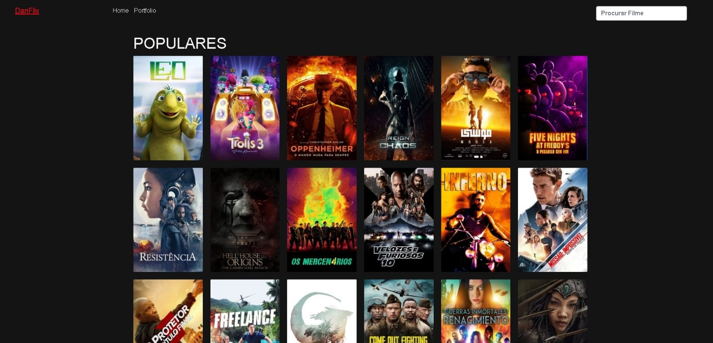
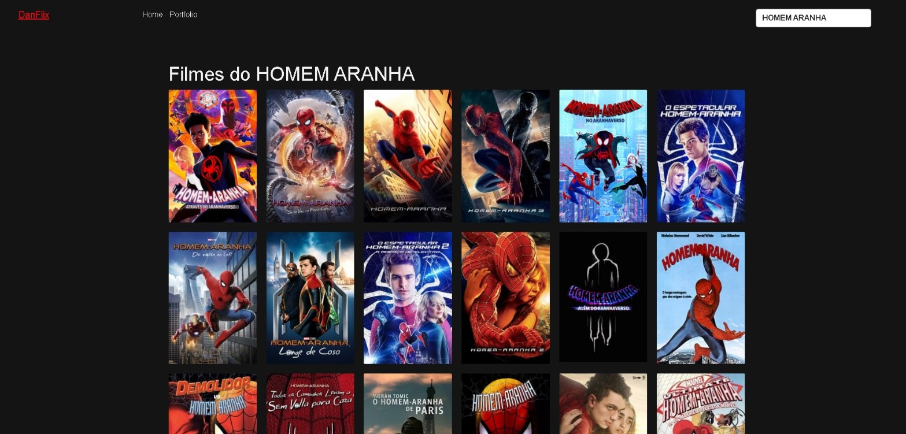
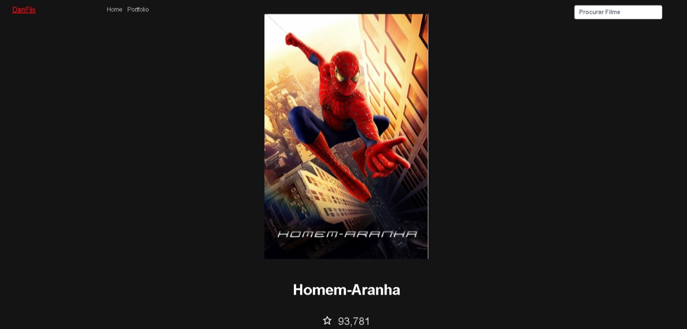

<h1 align="center">DANFLIX</h1>
 
<h1>
         
</h1>

<h1>Principais Características:</h1>

<h3>Integração com a API TMDb:</h3>
 Utilizando a biblioteca RestSharp, a aplicação realiza chamadas à API TMDb para obter informações atualizadas sobre filmes em cartaz, filmes mais populares, e filmes mais bem avaliados. Isso permite que a aplicação mantenha-se dinâmica e forneça dados precisos aos usuários.

<h1>Design Responsivo:</h1>
 A interface da aplicação é projetada para ser responsiva, adaptando-se automaticamente a diferentes tamanhos de tela, proporcionando uma experiência de usuário consistente em dispositivos desktop, tablets e smartphones. Isso garante que os usuários possam acessar a aplicação de forma conveniente em qualquer dispositivo.

<h1 ></h1>

<h1>Pesquisa de Filmes:</h1>
 Além de exibir informações sobre os filmes em destaque, a aplicação permite que os usuários realizem pesquisas por títulos específicos. Isso proporciona uma experiência personalizada, permitindo que os usuários encontrem rapidamente os filmes de seu interesse.

<h1>  </h1>
<h1>Detalhes do Filme:</h1>

A aplicação oferece uma funcionalidade robusta que permite aos usuários explorarem detalhes específicos de cada filme. Ao clicar em um filme em particular, os usuários têm acesso a uma página de detalhes que inclui informações mais aprofundadas sobre o filme. Esses detalhes incluem:

<h3>Número de Curtidas:</h3> Exibe a quantidade de usuários que curtiram o filme. Isso proporciona uma indicação rápida da popularidade e aceitação do filme entre o público.

<h3>Orçamento e Receita:</h3> Apresenta o montante gasto na produção do filme, bem como a receita total gerada. Esses dados financeiros oferecem uma perspectiva sobre o sucesso econômico do filme.

<h3>Duração do Filme:</h3> Indica o tempo de duração do filme, permitindo que os usuários planejem seu tempo ao assistir.

<h3>Sinopse Detalhada:</h3> Fornece uma descrição mais completa e detalhada do enredo do filme, ajudando os usuários a entenderem melhor a história antes de decidirem assisti-lo.

Essa funcionalidade amplia a experiência do usuário, permitindo uma exploração mais profunda e informada sobre os filmes de seu interesse. Além de simplesmente visualizar a lista de filmes em cartaz, os usuários podem tomar decisões mais embasadas sobre quais filmes assistir, considerando aspectos financeiros, de popularidade e narrativos.

<h1>Tecnologias Utilizadas:</h1>

- ASP.NET MVC
- C#
- RestSharp (para consumir a API TMDb)
- HTML, CSS, JavaScript (para a interface do usuário)
- Bootstrap (para design responsivo)
- Visual Studio (ambiente de desenvolvimento)

 
  
  
  
  
  
          

